# Encrypted Sandboxie-Plus Discord Setup

> **Prerequisite:** This guide assumes a one-year Sandboxie-Plus Personal-Advanced
> subscription. The license can be reused on unlimited devices and continues to
> work after expiry — only *updates* require renewal.

---

## 1. Create the encrypted box

Create a new **secure, encrypted** box. During creation:

- Enable **"Mount Box Image"** with **"Protect Box Root From Access By Unsandboxed Processes"**.
  This protects the sandboxed filesystem from any process outside the box.
- Enable **"Lock the box when all processes stop"** so the encrypted image
  auto-unmounts once the last sandboxed program exits.

You can verify root protection is active at `C:\Sandbox\YOUR_USER` while the
sandbox is running (see [Verifying isolation](#5-verifying-isolation) below).

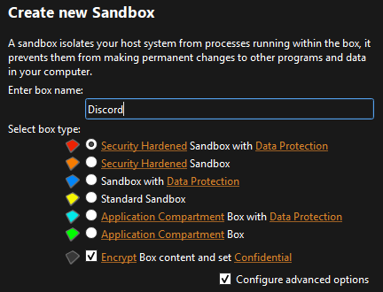

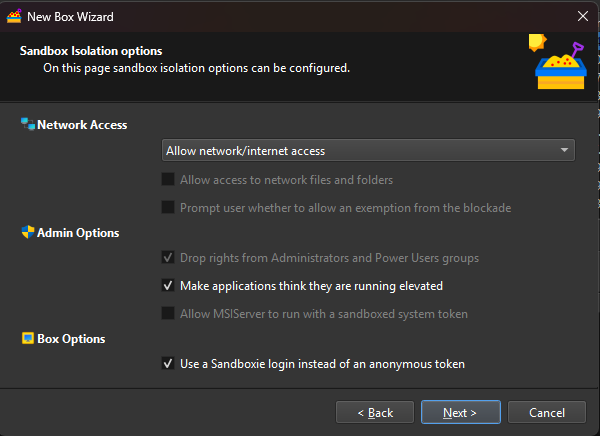

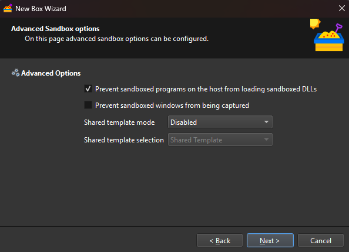

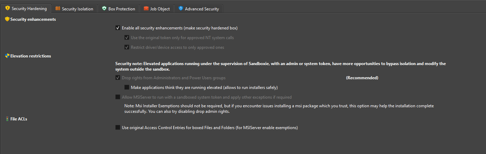

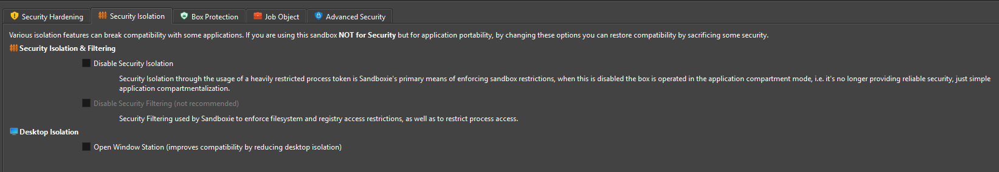

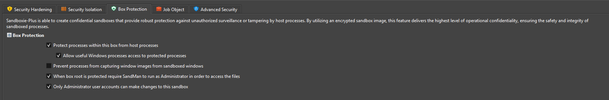

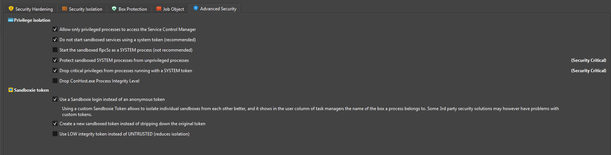

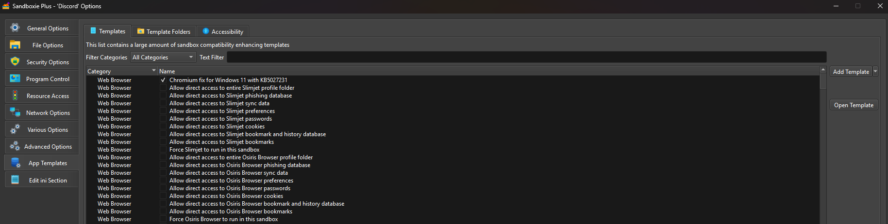

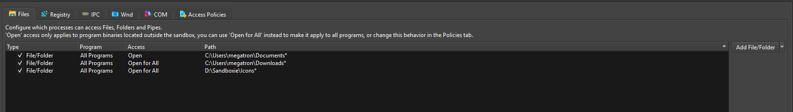

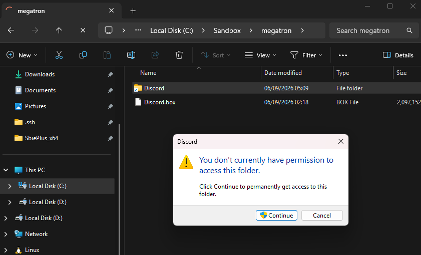

---

## 2. Compatibility settings (required on Windows 11)

In Sandboxie-Plus compatibility settings (**App Templates**), enable:

- **"Chromium Fix for Windows 11"**

Without this, Discord (and other Chromium-based apps) will fail to start on
Windows 11.

Disable "Make applications think they are running elevated" (the FakeAdminRights setting). Dorion's WebView2 rendering engine performs its own privilege checks at startup, and Sandboxie's fake elevation status conflicts with this, causing the app to launch with no visible window (silent WebView2 initialization failure, often paired with an SBIE2189 message or webview IPC error in the logs).

---

## 3. Install Discord inside the box

Make sure the box is mounted WITHOUT root protection for the installation. If root protection is on, the box's file system cannot be viewed in Windows Explorer.

Open a console **inside the encrypted sandbox**:
right-click the box → **Run → Standard Applications → Command Console (Admin)**.

Then run one of the following.

**Discord**

The manual install lays down Discord's files by hand rather than through the official installer. This produces an install that Discord's updater does not consider fully "finalized." Discord uses a native (Rust) updater — `updater.node`, loaded by the app on every launch — which validates its install plan against Discord's servers each time Discord starts.

When the installed version is the current published version, the updater tries tovalidate/finalize the *running* version. It finds `Discord.exe` already running from the target directory and treats this as fatal, throwing `InconsistentInstallerState: Attempt to install host that is currently running`. The window opens for a second, then closes.

Installing a version that is *behind* the server (here 1.0.9255) sidesteps the crash, because it routes the updater down the ordinary update path instead of the fatal finalize-the-running-version path.

Because the installed version is behind the server, Discord's updater does exactly what it's designed to do: on launch it detects a newer version, downloads it in the background, and applies it. So the manual install is only a *bootstrap* — a known-good starting point that launches cleanly — and Discord brings itself up to the current version automatically from there. You end up running the latest Discord without ever hitting the installer (which fails in the Privacy Enhanced box) and without hitting the updater crash.

```cmd#
"D:\Sandboxie\discord-sandbox\scripts\shared\install-discord.bat"
```

**Dorion (lightweight Discord client):**

```cmd
curl -L -o "%USERPROFILE%\Downloads\Dorion-setup.exe" "https://github.com/SpikeHD/Dorion/releases/download/v6.13.0/Dorion_6.13.0_x64-setup.exe"
"%USERPROFILE%\Downloads\Dorion-setup.exe"
```

Then right click the box and create a shortcut for the installed Dorion on your desktop:

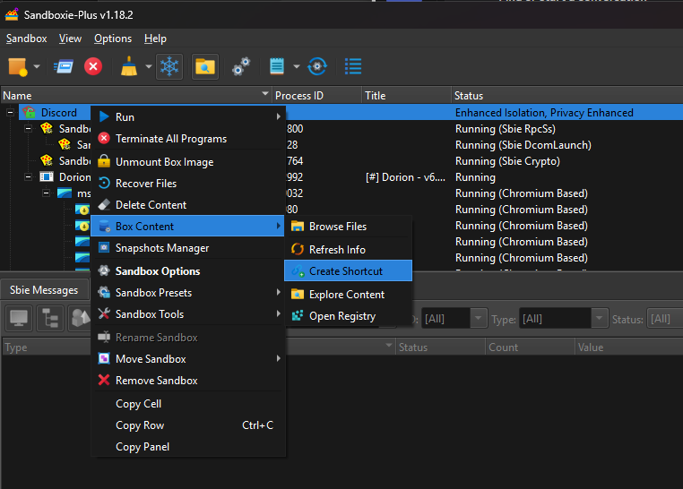

Map the shortcut to use your chosen icon. Note that when the box is unmounted or protected, icons
inside the box won't be available to Windows externally, and likewise to icons external; unless mapped to a shared folder.

---

## 4. Resource access

> **This is how you get files in and out of the encrypted box.**

The box's file system is sealed: with root protection on, the sandboxed
**Explorer closes immediately** and there is no in-box file browser by default,
so you cannot drag files in through a sandboxed window. To move files between
the host and the box, **one host folder is deliberately mapped through** — your
**Downloads** folder:

```
C:\Users\megatron\Downloads
```

Add this path under **Resource Access → File Access → Direct Access**
(the "Open for All Programs" option). Once set:

`Downloads` is the single, intentional opening in an otherwise sealed box — treat
it as the airlock. Anything outside it stays isolated. Keep this path as narrow
as you're comfortable with; widening it widens the host↔box surface.


#### [Optional] Browse inside the box at runtime even when it's locked

explorer.exe is the Windows shell itself, not just a file browser — it needs broad window-station, IPC, and COM access to function, which is exactly what a hardened/privacy-mode box restricts by default. Running it inside such a box typically crashes it immediately. Explorer++ works because it's a standalone app that browses files without needing shell-level privileges. It can be installed and opened using the following command:

```cmd
curl -L -o "%USERPROFILE%\Downloads\explorerpp.zip" "https://github.com/derceg/explorerplusplus/releases/download/version-1.4.0/explorerpp_x64.zip"
mkdir "%USERPROFILE%\Downloads\Explorer++"
tar -xf "%USERPROFILE%\Downloads\explorerpp.zip" -C "%USERPROFILE%\Downloads\Explorer++"
"%USERPROFILE%\Downloads\Explorer++\Explorer++.exe"
```

---

## 5. Launching Discord

Sandboxie-Plus can create shortcuts directly from its embedded viewer, or you
can launch the installed executable from a command line:

```cmd
"D:\Sandboxie\Installer\SbiePlus_x64\Start.exe" /box:YOUR_BOX_NAME cmd.exe /c start "" "%LocalAppData%\Discord\Update.exe" --processStart Discord.exe
```

```cmd
"D:\Sandboxie\Installer\SbiePlus_x64\Start.exe" /box:YOUR_BOX_NAME cmd.exe /c start "" 
"C:\Sandbox\megatron\Discord\user\current\AppData\Local\Dorion\Dorion.exe"
```

Replace `YOUR_BOX_NAME` with your box's name. If you installed Dorion instead,
point the launch at Dorion's executable inside the box.

Alternatively you can create a shortcut via the Sandboxie-Plus GUI:


---

## 6. Links open outside the sandbox — msedge.exe is a breakout process

> **`msedge.exe` is configured as a breakout process, so every link you click in
> Discord opens in your normal browser *outside* the sandbox.**

This is set under **Program Control → Breakout Programs** (INI:
`BreakoutProcess=msedge.exe`). When Discord hands a URL to the browser, Sandboxie
lets that browser process "break out" and run **unsandboxed on the host**, rather
than launching a browser trapped inside the box. Practically, that means:

- Clicking a link in Discord → opens in your host browser, normal session,
  normal profile.
- The sandbox stays dedicated to Discord itself; general web browsing happens on
  the host as usual.

Substitute your actual browser's process name if you don't use Edge (e.g.
`chrome.exe`, `firefox.exe`).

**Advanced variant:** if you'd rather the broken-out browser land in a *dedicated*
web-browsing box instead of the host, pair the breakout with a
BreakoutDocument / target-box directive so the broken-out program is captured
into that other box rather than escaping to the host.

---

## 7. Verifying isolation

With the box running, confirm the sandboxed filesystem is sealed from the host.
In normal Windows File Explorer, try to open:

```
C:\Sandbox\YOUR_USER\YOUR_SANDBOX\user\current\AppData\Roaming\discord
```

Opening `C:\Sandbox\YOUR_USER` — or any path beneath it — should produce an
**Access Denied** error from Windows.

## 8. Automatic unlock (TPM-sealed passphrase)

Rather than typing the box password each time, the passphrase is sealed to the
machine's TPM and gated behind Windows Hello, then handed to Sandboxie to mount
the box and open Discord. Two scripts handle this.

Run **`setup-sbiebox.ps1` once**, as the user who will launch the box. It creates
a non-exportable RSA key inside the TPM (the private key can never leave the
chip), prompts for the box passphrase a single time, encrypts it with that key,
and writes only the ciphertext to `%LOCALAPPDATA%\sbiebox.bin` — the plaintext is
never stored. Because the key is created with a ProtectKey UI policy, the TPM
will demand Windows Hello (PIN or biometric) on every future decrypt. Re-running
setup is blocked once the key exists; see the script header to reset.

**`unlock-sbiebox.ps1` runs on every launch** and is what the shortcut actually
calls. It first checks whether the box is already mounted; if it is, it skips
straight to launching another client instance. If not, it opens the TPM key —
triggering the Windows Hello prompt — decrypts the blob to recover the
passphrase, mounts the encrypted box with root protection, scrubs the passphrase
from memory, and launches Dorion inside the box. One shortcut therefore both
opens the box the first time and relaunches afterward.

The `.ps1` is invoked through a small VBS wrapper (`launch-discord.vbs`) so no
console window flashes; point your shortcut's target at that `.vbs`, give it
Discord's icon, and pin it anywhere. A single click releases the passphrase after
Windows Hello, mounts the box, and opens Dorion.

The box password is never typed routinely or stored in plaintext — it
exists only as TPM-sealed ciphertext, useless without this machine's TPM, and
unlockable only after Windows Hello confirms it's you. Combined with the
auto-unmount from step 1, the encrypted box is mounted on demand and torn down
when you're done. Note one boundary: mounting passes the passphrase on
`Start.exe`'s command line, where it's briefly visible to local process
inspection while the mount runs.

### Troubleshooting Icon Not Appearing on Windows 11

If an application icon fails to appear on the taskbar, the taskbar icon cache may need to be refreshed with access to the icon location. To resolve this issue, disable box root protection, launch the application, and reset the icon cache by running the following commands in Command Prompt as Administrator: `taskkill /f /im explorer.exe` to terminate Windows Explorer, `cd %localappdata%` to navigate to the local application data folder, `del IconCache.db` to remove the corrupted cache file, and `start explorer.exe` to restart Windows Explorer. Windows will automatically rebuild the icon cache upon restart, restoring proper icon display on the taskbar.

```sh
taskkill /f /im explorer.exe
cd %localappdata%
del IconCache.db
start explorer.exe
```

Note Sandboxie-Plus is unable to merge the icons on the taskbar:


---

*Confirmed working on Windows 11 Pro as of 2026-02-09 with enhanced security
features enabled.*
